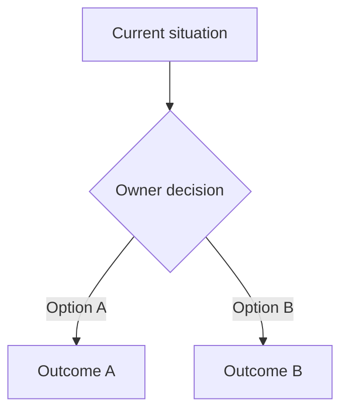

# Output template

Use the original discussion order. Keep the report concise enough to scan, but include the evidence needed to defend each decision.

Use this exact order for every comment:

1. title;
2. original comment;
3. commented diff;
4. judgment;
5. `show-me` visual and decisive evidence;
6. action;
7. proposed response.

Every inline comment must show the exact diff hunk from the commented revision before the judgment. Put the path, base and head revisions, side, and anchored line in the heading. Preserve the platform's stored diff hunk exactly. Do not add highlights, ellipses, or annotations inside it. If the platform does not provide the hunk, reproduce it from the stored revisions and label it `Reconstructed commented diff`. The later `show-me` visual explains the judgment and does not replace the commented diff.

For a general comment without a position, write `**General comment:** No diff anchor.` If it makes a claim about specific code, show the smallest exact relevant diff and label it `Relevant diff` instead.

````markdown
## 1. <Short comment title>

> « <Exact original comment> »

**Commented diff** (`<path>`, `<base SHA>..<head SHA>`, `<old|new>` side; anchor: line `<line>`)

```diff
<Exact diff hunk from the commented revision>
```

**Judgment: Legit, blocking**

**Show-me:**

```text
<Smallest before/after flow or corrected code shape>
```

<One short paragraph with the decisive code, spec, or standards evidence.>

**Action:** <Change required, addressed and verified, or no change.>

**Proposed response:**

> <Paste-ready response in the reviewer's language.>
````

For a non-blocking correction:

```markdown
**Judgment: Legit, non-blocking cleanup**
```

For a rejected premise:

````markdown
## N. <Short comment title>

> « <Exact original comment> »

**Commented diff** (`<path>`, `<base SHA>..<head SHA>`, `<old|new>` side; anchor: line `<line>`)

```diff
<Exact diff hunk from the commented revision>
```

**Judgment: Not legit**

**Show-me:**

```text
<caller or workflow>
      |
      v
<fact that disproves the premise>
```

<Explain the strongest interpretation of the concern, then the decisive contrary evidence.>

**Action:** No change.

**Proposed response:**

> <Respectful, paste-ready response.>
````

For a policy decision:

````markdown
## N. <Short comment title>

> « <Exact original comment> »

**Commented diff** (`<path>`, `<base SHA>..<head SHA>`, `<old|new>` side; anchor: line `<line>`)

```diff
<Exact diff hunk from the commented revision>
```

**Judgment: Needs opinion**

**Show-me:**



| Policy | Benefit | Cost |
|---|---|---|
| Option A | ... | ... |
| Option B | ... | ... |

**Decision owner:** <Product, domain, security, operations, or architecture owner>

**Current default:** <What the written spec or existing behavior currently requires>

**Action:** Wait for owner decision. Do not silently change policy.

**Proposed response:**

> <Paste-ready response that asks for the decision without pretending the code can decide it.>
````

Finish with:

```markdown
## Summary

- **Legit:** N, with blocking/non-blocking split
- **Not legit:** N
- **Needs opinion:** N
- **Owner decisions:** <comment numbers or none>

## Verification

- <Checks and evidence that passed>
- <What was not verified>
- No replies were posted and no threads were resolved.
```

Do not include analysis notes, private matrices, temporary file paths, tokens, or API payloads in the final report.
